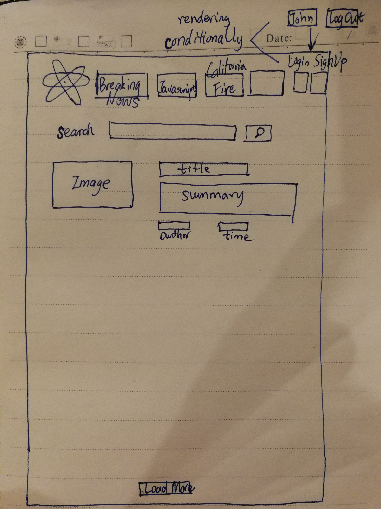

# Reactive-News
### Introduction
This is a news application [Reactive News](http://stupid-paint.surge.sh/) that
provides users with latest breaking news and other categories includes Technology, Politics, Sports, Economy and Real Estate.
It consumes [News API](https://newsapi.org/docs)
that indexes articles from over 30,000 worldwide sources.

### Features and Specs
Here is a short video Demo[Youtube Link](https://www.youtube.com/watch?v=jjfTuyLO22A)
- User is able to search news from over 30,000 news sources
- User can click on the news title and get redirected to the source website
- some UI components are empowered by [Ant Design of React](https://github.com/ant-design/ant-design/)
- User is able to Log in, Sign up, or Log out.
### Usage
- Fork or clone this repo
- cd into the repo
- run npm install --save antd axios
- npm start
### Code Snippet
Ant Design is a super convenient UI library for building responsive and
interactive React applications. The grid system makes it easy to layout
my Header Component.
```javascript
<Row type="flex" align="middle">
  <Col span={2}>
    <a className="NewsLogo">
      
    </a>
  </Col>
  <Col span={14} className="NavBar">
    <NavBar currentNavTab={this.props.newsCategory}
              menuItemSelect={this.menuItemSelect}
            />
  </Col>
  <Col span={4} className="SearchBox">
    <SearchBox handleSearch={this.handleSearch}
               handleUserInput={this.handleUserInput}
               value={this.state.searchTerm}
            />
  </Col>
  <Col span={4} className="NavUser">
    {this.state.isLoggedIn ? NavUserLogoutCompo : NavLoginRegisterCompo}

  </Col>
</Row>
```
### wireFrame

